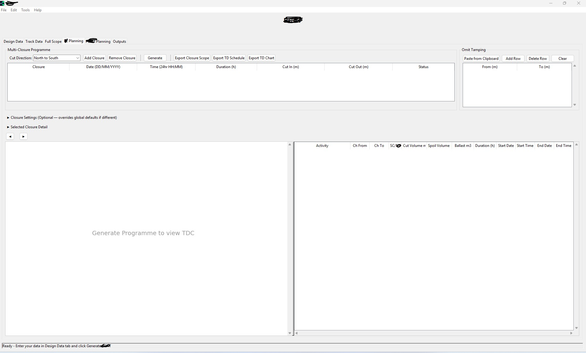
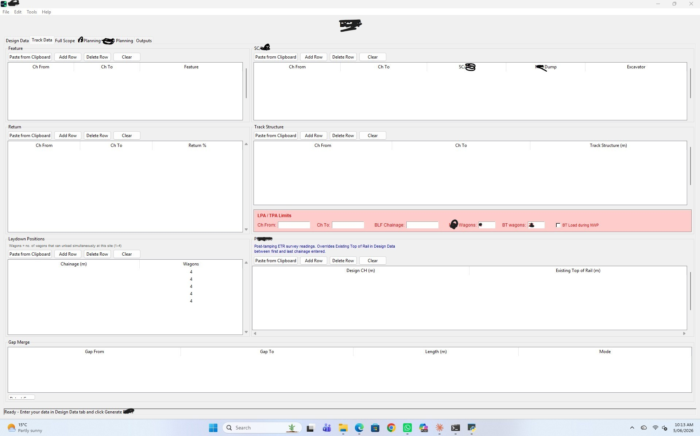
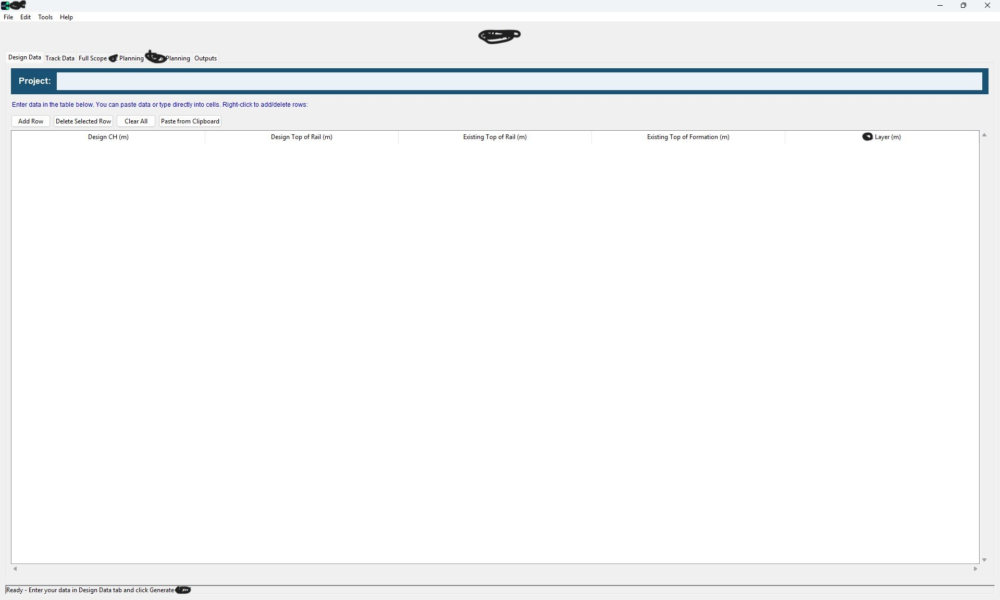

# Ballast Cleaning Program Optimizer

## What exactly is this application?

Through iteration and thousands of calculations, this app identifies the fastest possible route to completing scope — in other words, it maximises the amount of ballast cleaning scope achievable in a set obstruction or working window. The application generates a time-distance chart (TDC) based on inputs received from the design team and obtained from the field: Design Top of Rail, Existing Top of Rail, Existing Top of Capping Layer, location of laydowns for dumping spoil, location of ballast reloading, ballast return rate, and so on.

Currently this work is done manually — basic spreadsheets, hand-manipulated data, and specialist (and expensive) software to draw the TDC itself. The manual handling along with the manual drawing of the TDC is an archaic way of doing things, especially in this day and age.

The application removes all manual handling. It automatically completes the calculations and outputs a TDC.

## Why is this better?

I think it's a game-changer, but why do I think so?

The most obvious benefit — and the smallest — is productivity. The company might be able to complete all of the planning and execution with less engineering firepower. That's not bad. But for large multi-national companies it's still a small win, and definitely not the game-changer.

## So what IS the game-changer?

There's a wider team and a wider network of stakeholders involved in planning and executing the ballast cleaning works. Sometimes, plans change. The planning team might get an instruction from management at the last minute that the date or duration of the working window has shifted, and at the same time management wants to know what the new plan and scope will look like. The team completing the work needs a new TDC. Supplementary documents tied to the TDC need to be updated and distributed to the field team. And all of this needs to happen within maybe 24 hours.

Instead of requiring an engineer to redo the TDC, the user simply changes the date and duration of the working window. Within two minutes, a suite of revised documents is generated and ready for distribution. That alone is significant — but it isn't the biggest win.

As BCAT generates the TDC, it runs multiple scenarios, planning track-machine staging to maximise the amount of ballast cleaning scope achievable within the given working window.

## But how? What scenarios does it run that the engineer can't?

The engineer *can* run these scenarios — but with the current Excel-based tooling, more engineering firepower is needed to find the true maximum scope for a given working window. Back to the scenarios:

- The app determines the best time to trigger the initial ballast drop, saving time.
- The app determines the best time to trigger a run to the ballast loading facility, reducing downtime for the tamping machines.
- Where there are gaps within the ballast cleaning scope, the app determines whether to complete one side of the gap before moving onto the other.

In every case, it picks a WINNER — whichever option maximises the amount of ballast cleaning scope within the working window.

THIS is the real win. The company has track machines and labour costing thousands of dollars an hour. Every hour saved is used to achieve additional scope. This is the REAL increase in productivity.
